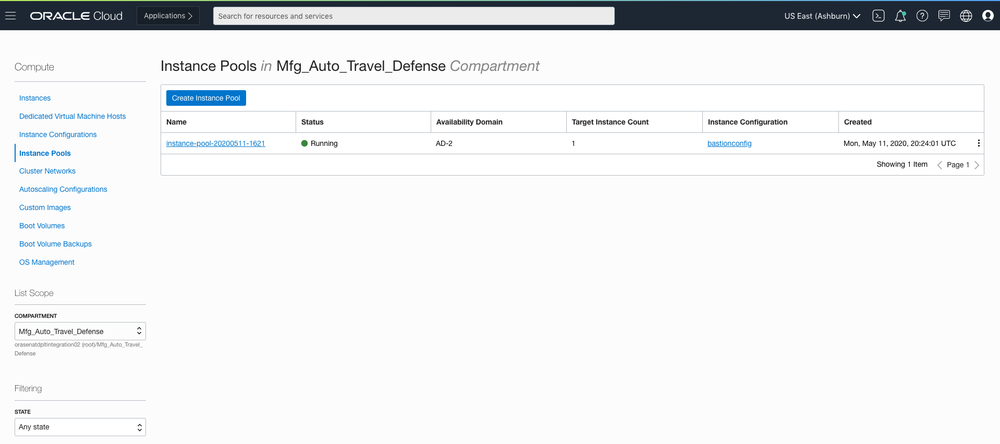
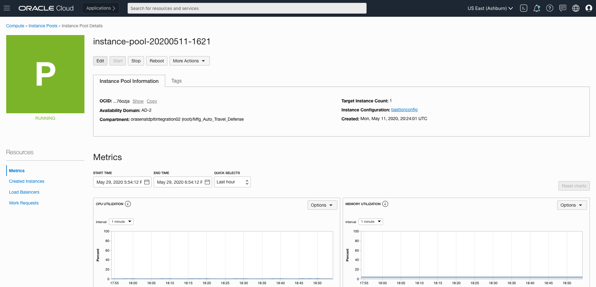
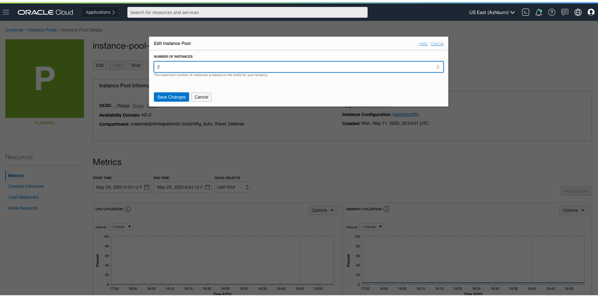
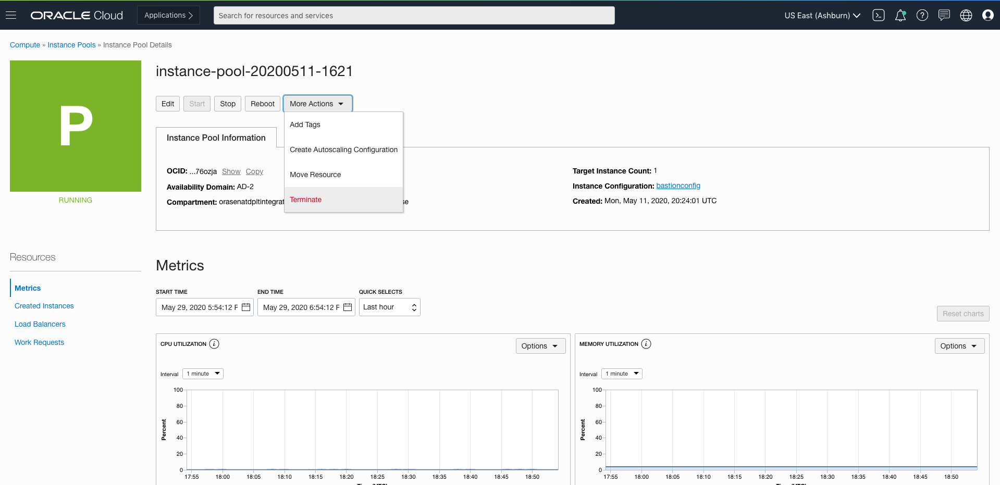
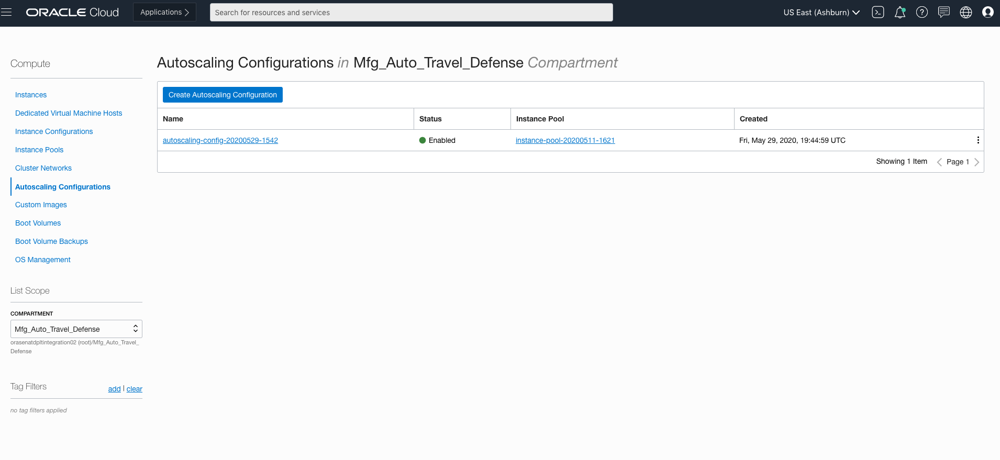
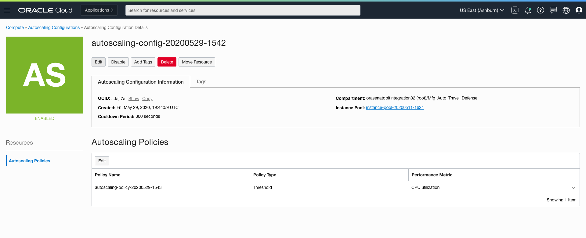
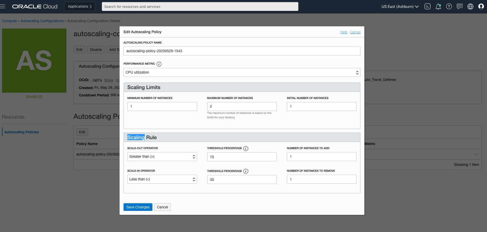

## Changing configurations for Instance Pools

If you enable Autoscaling configuration using the application, then by default an Instance Pool is created based on the Instance Configuration of App VMs. The Instance Pool by default has Target Instance Count of 2. 
In order to make any changes to the Instance Pool which includes terminating it, refer to the following steps:

- Open the navigation menu. Under Core Infrastructure, go to Compute and click Instance Pools.

- Choose the correct Compartment name to see the Instance Pool that was created by the application.

- Click on the name of the Instance Pool and click on the Edit button and select the new target instance count. 

Please note that, if you choose 0 instances then the Instance Pool will terminate all instances that it created but you will still be able to see the Instance Pool as Running. The deleted instances does not include the App VMs that were created outside of the Instance Pool.

- If you wish to terminate the Instance Pool, click on More Actions and hit the Terminate button. The instance created as part of Instance Pool will be automatically terminated. In this case the status of Instance Pool will turn to Terminated in the console.

## Changing confgurations for Autoscaling

If you enable Autoscaling configuration using the application, then by default an Autoscaling configuration is created on top of the Instance Pool for App VMs. The default configuration includes performance metrics as CPU utilization, threshold percentages between 70 and 30, maximum instances 2, minimum and initial instance as 1.

In order to make any changes to the Autoscaling configuration which includes terminating it, refer to the following steps:

- Open the navigation menu. Under Core Infrastructure, go to Compute and click on Autoscaling Configurations.

- Choose the correct Compartment name to see the Autsocaling Configuration that was created by the application.

- Click the autoscaling configuration that you're interested in and then click on Edit under Autoscaling Policies. Here you can make changes to performance metric, threshold percentages, minimum and maximum number of instances.

- If you wish to terminate the Autoscaling configuration click on Delete option.

